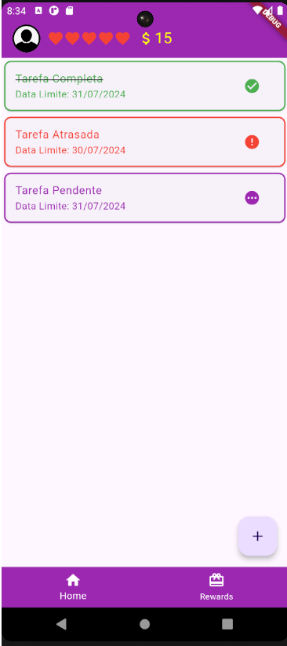
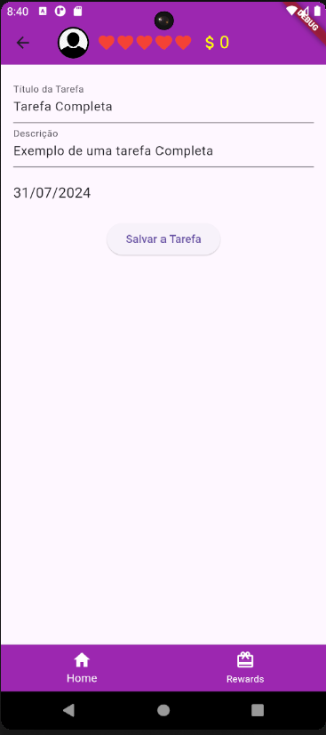

# ryc-desafio-do-modulo-basico
Desafio Renew Your Career - Flutter

# Aplicativo Jogo das Tarefas

Este é um aplicativo de lista de tarefas com funcionalidades adicionais de recompensas, permitindo aos usuários gerenciar tarefas, ganhar moedas e vidas.

## Funcionalidades

### HomePage
- **Adicionar Tarefa**: Clique no ícone de adicionar (+) para redirecionar para a tela de Registro.
- **Finalizar Tarefa**: Clique no card da tarefa para finalizar a tarefa.
  - Usuário ganha 5 moedas.
  - A cor do título da tarefa é alterada para verde e riscada.
- **Tarefa Expirada**: Quando o prazo da tarefa expira (dias restantes igual a -1):
  - O usuário perde uma vida (subtrai 1 coração no AppBar).
  - A cor do ícone e dos textos da tarefa é alterada para vermelho.

### Register
- **Título da Tarefa**: Campo obrigatório com no mínimo 3 letras.
- **Descrição da Tarefa**: Campo não obrigatório.
- **Data da Tarefa**: Campo obrigatório. Abre um calendário para selecionar a data no formato dd/MM/yyyy.
- **Botão de Salvar**: Valida todos os campos, salva os dados e retorna para a HomePage com as tarefas atualizadas.

### Rewards
- **Card de Recompensas**: Mostra imagem, título, descrição, ícone e valor da vida (5 moedas).
  - Clique no ícone para comprar uma vida.
  - Aumenta uma vida se o usuário possuir moedas suficientes e diminui a quantidade de moedas.

### Elementos Comuns a Todas as Telas
- **AppBar**:
  - Espaço para foto do usuário.
  - Espaço com 5 vidas/corações.
  - Espaço com ícone de moedas e quantidade de moedas (não pode ser menor que zero).
- **Rodapé**:
  - Ícone e título para redirecionar para a HomePage.
  - Ícone e título para redirecionar para a tela de Recompensas.

## Capturas de Tela

## Configuração do Projeto

1. Clone o repositório:
   git clone https://github.com/carlasnonaka/ryc-desafio-do-modulo-basico
   cd ryc-desafio-do-modulo-basico

2. Instale as dependências:
    flutter pub get

3. Execute o aplicativo:
    flutter run

## Estrutura do Projeto

- lib/
  - models/
    - task.dart
  - providers/
    - task_provider.dart
  - screens/
    - home_page.dart
    - register_page.dart
    - rewards_page.dart
  - widgets/
    - base_page.dart
    - task_card.dart
  - main.dart

## Como Contribuir

1. Faça um fork do projeto.

2. Crie uma nova branch:
    git checkout -b minha-feature

3. Faça suas alterações e commite:
    git commit -m 'Minha nova feature'

4. Envie para a branch principal:
    git push origin main

5. Abra um Pull Request.

## Licença
Este projeto está licenciado sob a MIT License.

## Contato
Para mais informações, entre em contato:

Email: carlasnonaka@gmail.com
LinkedIn: Carla Suemi Nonaka
